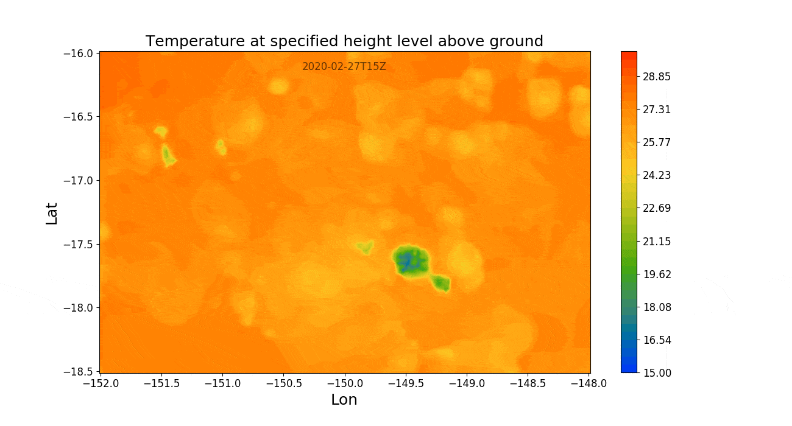

# PyMeteoFr

Python wrapper of the meteo-france web services ([WCS](https://www.ogc.org/standards/wcs) only).

```python
from IPython.display import Image
from pymeteofr import Fetcher

fetcher = Fetcher(token="__xxxxxxxxxxxxxxxxxxxxxxxxxxxxxxxxxxxxxxxxxxx__")
fetcher.select_product(dataset='arome', area='polynésie')
fetcher.select_coverage_id("Temperature at specified height level above ground")
fetcher.check_run_time(horizon=24)
fetcher.set_bbox_of_interest(208, -18.5, 212, -16)
fetcher.create_3D_array()
fetcher.make_movie(root_name="tahiti")
Image(filename="./data/tahiti.gif")
```
<p align="center">
  
</p>

## Requirements

[gifsicle](https://www.lcdf.org/gifsicle/) is needed when gif files are optimized.


Free software: MIT License
Copyright (c) 2020, Architecture & Performance