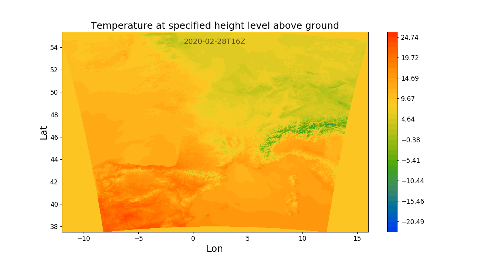

=====
Usage
=====

To use PyMeteoFr in a project::

    import pymeteofr

The first thing to do is to set a valid API key.

Setting the web service token
=============================

First we need to import the ``Fetcher`` class:

.. code-block:: python

    from pymeteofr import Fetcher

You can instanciate a ``Fetcher`` object without a token:

.. code-block:: python

    fetcher = Fetcher()
    fetcher.token is None

.. parsed-literal::

    True

The token can later be fetched using a credentials JSON file of
the form:

.. code-block:: json

   {
       "username": "john.doe",
       "password": "1234"
   }

This is done with the ``credentials_file_path`` argument of the ``fetch_token`` method:

.. code-block:: python

    fetcher.fetch_token(credentials_file_path='/home/john/Workspace/pymeteofr/notebooks/credentials.json')

.. parsed-literal::

    -- GetAPIKey request --

Or by directly giving a username and password:

.. code-block:: python

    fetcher.fetch_token(username="john.doe", password="1234")

.. parsed-literal::

    -- GetAPIKey request --

These username and password are the ones we got from support.inspire@meteo.fr. PyMeteoFr is using a ``GetAPIKey`` request to fetch the token. Note that if we give a wrong username/password, we still fetch a token from the web service, which is not going to be valid.

Finally the token can be directly given as an argument when instanciating the ``Fetcher`` object:

.. code-block:: python

    fetcher = Fetcher(token="__xxxxxxxxxxxxxxxxxxxxxxxxxxxxxxxxxxxxxxxxxxx__")

Selecting a product
===================

Now that the token is set, we need to choose which weather-related product we are interested in. This is done using the ``select_product`` method with appropriate arguments: ``dataset``, ``area`` and ``accuracy``. Here is the list of available products so far:

.. raw:: html

    

    
    <table border="1" class="dataframe">
      <thead>
        <tr style="text-align: right;">
          <th></th>
          <th>dataset</th>
          <th>area</th>
          <th>accuracy</th>
        </tr>
      </thead>
      <tbody>
        <tr>
          <th>0</th>
          <td>arpege</td>
          <td>world</td>
          <td>0.500</td>
        </tr>
        <tr>
          <th>1</th>
          <td>arpege</td>
          <td>europe</td>
          <td>0.100</td>
        </tr>
        <tr>
          <th>2</th>
          <td>arome</td>
          <td>france</td>
          <td>0.025</td>
        </tr>
        <tr>
          <th>3</th>
          <td>arome</td>
          <td>france</td>
          <td>0.010</td>
        </tr>
        <tr>
          <th>4</th>
          <td>arome</td>
          <td>antilles</td>
          <td>0.025</td>
        </tr>
        <tr>
          <th>5</th>
          <td>arome</td>
          <td>guyane</td>
          <td>0.025</td>
        </tr>
        <tr>
          <th>6</th>
          <td>arome</td>
          <td>réunion</td>
          <td>0.025</td>
        </tr>
        <tr>
          <th>7</th>
          <td>arome</td>
          <td>nouvelle-calédonie</td>
          <td>0.025</td>
        </tr>
        <tr>
          <th>8</th>
          <td>arome</td>
          <td>polynésie</td>
          <td>0.025</td>
        </tr>
      </tbody>
    </table>
    

Note that we do not need to enter all the arguments, but just give enough information to select a single product. In the following example, we select two products instead of one, which raises an error:

.. code-block:: python

    try:
        fetcher.select_product(dataset="arome", area="france")
    except ValueError as e:
        print(e)

.. parsed-literal::

      dataset    area  accuracy service_type
    2   arome  france     0.025          wcs
    3   arome  france     0.010          wcs
    Several services match the criteria

In this other example, no product matches the given criteria:

.. code-block:: python

    try:
        fetcher.select_product(dataset="arome", area="france", accuracy=0.03)
    except ValueError as e:
        print(e)

.. parsed-literal::

    No service matching the criteria

Now here is a case where a single produt is selected:

.. code-block:: python

    fetcher.select_product(dataset="arome", area="france", accuracy=0.01)

.. parsed-literal::
    -- GetCapabilities request --

This triggers a ``GetCapabilities`` request which returns some information about the selected product, mainly the list of available titles (variables) associated with the product:

.. code-block:: python

    fetcher.list_titles()

.. parsed-literal::

    ['Brightness temperature',
     'Convective available potential energy',
     'Geometric height',
     'High cloud cover',
     'Low cloud cover',
     'Medium cloud cover',
     'Pressure',
     'Relative humidity at specified height level above ground',
     'Temperature at specified height level above ground',
     'Wind speed (gust) at specified height level above ground',
     'Wind speed at specified height level above ground',
     'rainfall rate',
     'u component of wind at specified height level above ground',
     'u component of wind gust at specified height level above ground',
     'v component of wind at specified height level above ground',
     'v component of wind gust at specified height level above ground']

and the list of available run times (we will see more about that in the next section). Note that this list of titles depends on the chosen product.

An important point is that we only keep the titles that are available with a temporal resolution of 1 hour. Other titles are discarded.

Selecting a CoverageId
======================

A CoverageId is a combination of ``title`` and ``run_time``. The ``title`` is a variable (e.g. temperature, presure) resulting from a model and a ``run_time`` is a time stamp identifying when the model was run. 

So when we select a ``CoverageId`` we can enter the ``title`` and ``run_time`` as attributes to the ``select_coverage_id`` method. Actually, the ``title`` is mandatory but not the ``run_time``. If not entered, the latest available ``run_time`` is chosen. Let us choose for example the 'Pressure' ``title``:

.. code-block:: python

    fetcher.select_coverage_id(title='Pressure')
    fetcher.CoverageId

.. parsed-literal::

    'PRESSURE__GROUND_OR_WATER_SURFACE___2020-02-27T09.00.00Z'

The ``run_time`` information as well as the list of ``titles`` is re-built at each ``GetCapabilities`` request, for example when we select a product. However we can simply refresh this information with the ``update`` method:

.. code-block:: python

    fetcher.update()

.. parsed-literal::
    -- GetCapabilities request --

This can be useful for example if several hours have passed since a product was chosen. Now what if we want to look at the list of available run times? This is done using the ``list_available_run_times`` method:

.. code-block:: python

    run_times = fetcher.list_available_run_times('Relative humidity at specified height level above ground')
    print(run_times)

.. parsed-literal::

    ['2020-02-23T00', '2020-02-23T03', '2020-02-23T06', '2020-02-23T09', '2020-02-23T12', '2020-02-23T15', '2020-02-23T18', '2020-02-23T21', '2020-02-24T00', '2020-02-24T03', '2020-02-24T06', '2020-02-24T09', '2020-02-24T12', '2020-02-24T15', '2020-02-24T18', '2020-02-24T21', '2020-02-25T00', '2020-02-25T03', '2020-02-25T06', '2020-02-25T09', '2020-02-25T12', '2020-02-25T15', '2020-02-25T18', '2020-02-25T21', '2020-02-26T00', '2020-02-26T03', '2020-02-26T06', '2020-02-26T09', '2020-02-26T12', '2020-02-26T15', '2020-02-26T18', '2020-02-26T21', '2020-02-27T00', '2020-02-27T03', '2020-02-27T06', '2020-02-27T09']

We can now choose an earlier run time when selecting a CoverageId:

.. code-block:: python

    fetcher.select_coverage_id(title='Relative humidity at specified height level above ground', run_time=run_times[1])
    fetcher.CoverageId

.. parsed-literal::

    'RELATIVE_HUMIDITY__SPECIFIC_HEIGHT_LEVEL_ABOVE_GROUND___2020-02-23T03.00.00Z'

The ``Fetcher`` object also has a ``run_time`` attribute:

.. code-block:: python

	fetcher.run_time

.. parsed-literal::

	'2020-02-23T03.00.00Z'

Describing a CoverageId
=======================

Now that we selected a CoverageId, which corresponds to a run of a model, we need to know what's inside in terms of spatial and temporal coverage. This is why we have a ``describe`` method, which uses a ``DescribeCoverage`` request to fetch the maximum bounding box, and the available time steps of the simulation results.

.. code-block:: python

    fetcher.describe()

.. parsed-literal::

    -- DescribeCoverage request --

We can then have a list of the available time steps at the time of the request with the ``dts`` attribute:

.. code-block:: python

    fetcher.dts

.. parsed-literal::

    DatetimeIndex(['2020-03-13 06:00:00', '2020-03-13 07:00:00',
                   '2020-03-13 08:00:00', '2020-03-13 09:00:00',
                   '2020-03-13 10:00:00', '2020-03-13 11:00:00',
                   '2020-03-13 12:00:00', '2020-03-13 13:00:00',
                   '2020-03-13 14:00:00', '2020-03-13 15:00:00',
                   '2020-03-13 16:00:00', '2020-03-13 17:00:00',
                   '2020-03-13 18:00:00', '2020-03-13 19:00:00',
                   '2020-03-13 20:00:00', '2020-03-13 21:00:00',
                   '2020-03-13 22:00:00', '2020-03-13 23:00:00',
                   '2020-03-14 00:00:00', '2020-03-14 01:00:00',
                   '2020-03-14 02:00:00', '2020-03-14 03:00:00',
                   '2020-03-14 04:00:00', '2020-03-14 05:00:00',
                   '2020-03-14 06:00:00', '2020-03-14 07:00:00',
                   '2020-03-14 08:00:00', '2020-03-14 09:00:00',
                   '2020-03-14 10:00:00', '2020-03-14 11:00:00',
                   '2020-03-14 12:00:00', '2020-03-14 13:00:00',
                   '2020-03-14 14:00:00', '2020-03-14 15:00:00',
                   '2020-03-14 16:00:00', '2020-03-14 17:00:00',
                   '2020-03-14 18:00:00', '2020-03-14 19:00:00',
                   '2020-03-14 20:00:00', '2020-03-14 21:00:00',
                   '2020-03-14 22:00:00', '2020-03-14 23:00:00',
                   '2020-03-15 00:00:00'],
                  dtype='datetime64[ns]', freq='H')

While the spatial coverage is given by the ``max_bbox`` attribute:

.. code-block:: python

    fetcher.max_bbox

.. parsed-literal::

    (-12.0, 37.5, 16.0, 55.4)

This is a bounding box expressed in WGS84 (EPSG:4326) CRS. However the computation uses a different CRS, which may create some empty zones within the WGS84 bounding box:

Setting the horizon of interest
===============================

When the run time is fairly new, all the time steps are not available yet: they are progressively being pushed to the web service. So there is some chance that the latest run time is not complete. This is why we created the ``check_run_time`` method. The argument is the horizon of the forecasts, expressed in hours, that you want. Suppose that you are interested in the next 24 hours, starting from now:

.. code-block:: python

    fetcher.check_run_time(horizon=24)

.. parsed-literal::

    -- DescribeCoverage request --
    Switched to previous (Python index: -2) run time
    -- DescribeCoverage request --

What ``check_run_time`` does, is looping through the available run times from latest to oldest, until the time steps corresponding to the next 24 hours are found, and then setting this run time/CoverageId. Also it creates a list of the time steps of interest:

.. code-block:: python

  fetcher.check_run_time(4)

.. parsed-literal::

	-- DescribeCoverage request --

.. code-block:: python

	fetcher.requested_dts

.. parsed-literal::

	['2020-03-13T17:00:00Z',
	 '2020-03-13T18:00:00Z',
	 '2020-03-13T19:00:00Z',
	 '2020-03-13T20:00:00Z']

.. code-block:: python

	from datetime import datetime
	datetime.now().isoformat()

.. parsed-literal::

	'2020-03-13T17:02:16.522364'

These datetimes always are in the future. These are the time steps that we are going to fetch with the ``create_3D_array`` method.